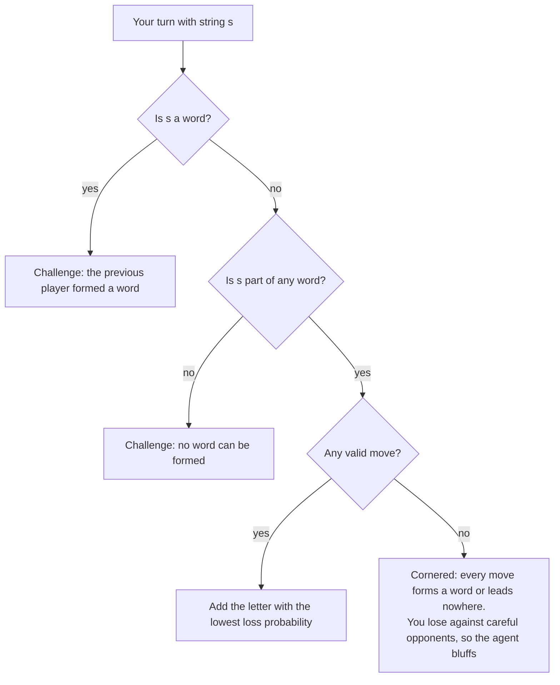
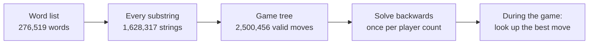
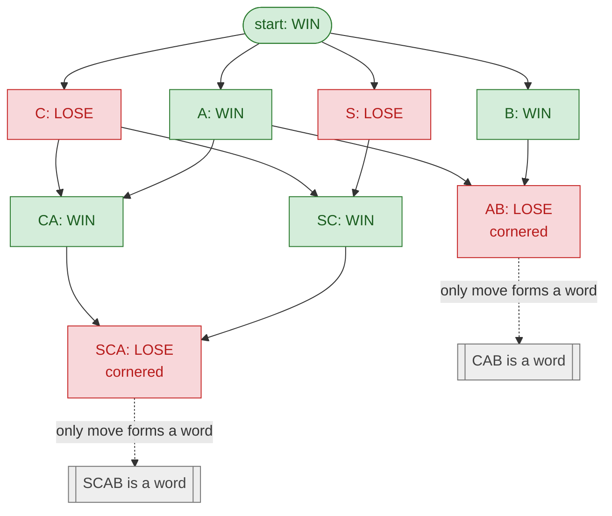
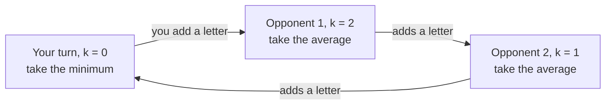

# The Game Tree Agent

The Game Tree Agent solves Wordn't exactly instead of approximating it. Before the game starts, it builds the tree of every string that can ever appear in a game and works out, for every one of them, how likely you are to lose from there. During the game, every move is a lookup.

With 2 players this is perfect play: **the first player has a forced win by opening with L or U.**

## 1. Why Wordn't can be solved

Wordn't belongs to a family of games that game theory can solve completely:

- **Perfect information.** Everyone sees the whole position (the current string). There are no hidden cards and no dice.
- **Finite, with no cycles.** Every move makes the string one letter longer, and no word is longer than 15 letters, so the game always ends and a position can never repeat.
- **One loser per game.** Every game ends with someone forming a word, getting cornered, or losing a challenge.

For two players, [Zermelo's theorem](https://en.wikipedia.org/wiki/Zermelo%27s_theorem_(game_theory)) says that in such a game one of the players has a strategy that wins no matter what the other does. You find it by **backward induction**: label the positions where the game ends, then work backwards one move at a time. Wordn't is a close relative of the word game [Ghost](https://en.wikipedia.org/wiki/Ghost_(game)) and its variant Superghost, where letters can also be added to either end, and the same technique applies to them.

## 2. Positions and moves

The position is just the current string. Whose turn it is follows from the string's length: the player who adds letter number `len(string) + 1`.

An agent that knows the whole word list never has to guess about challenges, so the only real decision is which letter to add:

A **valid move** adds a letter to the start or the end so that the new string is still part of some word, but is not a word itself. Anything else loses straight away to a correct challenge.

## 3. The game tree

Every string that can appear in a game is a substring of some word. The agent builds a graph with one node per substring and one edge per valid move:

- **Moves come from the words themselves.** For every word and every substring `word[i:j]`, the moves are `word[i-1:j]` (add to the start) and `word[i:j+1]` (add to the end). This finds every valid move without trying all 52 letters for every string.
- **Words are dead ends.** Moving onto a word loses, so words are never valid moves. 242,980 strings have no valid moves at all: whoever has to move from them is cornered.

## 4. Two players: solving backwards

Each position is labelled from the point of view of the player about to move:

- **LOSE** if they are cornered, or if every valid move leads to a position labelled WIN for the opponent.
- **WIN** if at least one valid move leads to a position labelled LOSE for the opponent.

Here is the whole game for a tiny dictionary containing just **CAB** and **SCAB**:

Reading it from the bottom up:

1. **AB** and **SCA** are cornered: the only letters that keep them inside a word complete **CAB** or **SCAB**. Whoever has to move from them loses.
2. **CA** and **SC** can move to **SCA**, handing the opponent a cornered string, so they are WIN.
3. Every move from **C** (to **CA** or **SC**) hands the opponent a WIN position, so **C** is LOSE. **S** is LOSE for the same reason.
4. At the start, playing **C** or **S** gives the opponent a LOSE position. **The first player wins by opening with C or S.**

The agent does exactly this on the full word list. The result: with 2 players, **the first player wins by opening with L or U**. Every other opening loses against a perfect opponent.

## 5. Three or more players

With more players there is no single "correct" strategy. Each game has one loser, and whether you lose depends on what several other players do. They might not care which of them corners you, or they might accidentally help you. So the agent asks two questions:

1. **Can I be forced to lose if every other player teams up against me?** If not, the move is *safe*.
2. **If no move is safe, which move is least likely to lose against players who don't coordinate?**

One number answers both. Let $P_k(s)$ be the probability that you eventually lose from string $s$, when it will be your turn again after $k$ more letters. You pick the move that minimises it, and each opponent adds a random valid letter:

$$P_0(s) = \min_{s' \in \text{moves}(s)} P_{n-1}(s') \qquad \text{(your turn; } P_0(s) = 1 \text{ if you are cornered)}$$

$$P_k(s) = \frac{1}{|\text{moves}(s)|} \sum_{s' \in \text{moves}(s)} P_{k-1}(s') \qquad \text{(an opponent's turn; } P_k(s) = 0 \text{ if they are cornered)}$$

After your move, $n - 1$ opponents add a letter before it's your turn again, so the agent compares moves by $P_{n-1}$. For 3 players the cycle looks like this:

**Why $P = 0$ means safe.** Every valid opponent move gets a positive probability. So $P = 0$ means that *no* sequence of opponent moves leads to your loss, as long as you keep choosing minimum moves. That is exactly the "everyone teams up against me" guarantee. With 2 players, $P = 0$ is exactly the WIN label from section 4.

**Why random opponents.** It's the simplest model that doesn't assume opponents coordinate, and it only matters when no safe move exists. When a safe move does exist, the agent always takes one.

### Openings by number of players

| Players | Best opening | Loss probability | Equal share (1 / players) | Positions where the player to move can't be forced to lose |
|---|---|---|---|---|
| 2 | L or U | 0 (forced win) | 0.500 | 53.9% |
| 3 | R | 0.033 | 0.333 | 65.0% |
| 4 | T | 0.104 | 0.250 | 71.1% |
| 5 | T | 0.124 | 0.200 | 75.1% |
| 6 | F | 0.136 | 0.167 | 77.7% |
| 7 | J | 0.147 | 0.143 | 79.7% |
| 8 | J | 0.094 | 0.125 | 81.0% |

Loss probabilities for 3 or more players assume opponents that play random valid moves. With 3 or more players, no opening is completely safe.

## 6. Computing it

Strings only grow, so the agent solves them in order of length, from the longest down to the empty string. When it reaches a string, all of its moves have already been solved. Each length is one vectorised `numpy` step (`np.minimum.reduceat` for your turn, `np.add.reduceat` for opponents' turns).

| Step | Time | When |
|---|---|---|
| Build the game tree | about 25 s, under 1 GB | once per word list |
| Solve for a number of players | under 2 s | once per player count |
| Choose a move | instant (a lookup) | every turn |

**Verification:**
- On three smaller dictionaries (3,000 to 8,000 words), the solver matches an independent brute-force solver exactly for 2, 3 and 5 players. The largest difference is 2.2e-16 (floating-point rounding), with 0 mismatched win/loss labels for 2 players.
- In 200 games of 2-player self-play, the first player won every game.

## 7. Comparison with the Super Agent

The [Super Agent](../SuperAgent) estimates the same thing with *halting words*: words whose length means you would be the one to complete them. Its *basis word ratio* (BWR) is the share of words a move could lead to that aren't halting. A BWR of 1 is its "sure win".

| | Super Agent | Game Tree Agent |
|---|---|---|
| What it reasons about | Word lengths: which words you'd complete, plus words you'd be forced through as a prefix or suffix | Every reachable string and every move, exactly |
| "Sure win" | BWR = 1, which was always safe in our tests but misses many safe moves | $P = 0$, which is exact: it finds every safe move |
| How far ahead it looks | One opponent turn (the metagame step) | To the end of the game |
| Opponent model | The next player plays carefully | Opponents play random valid moves, used only when no move is safe |
| With 2 players | An approximation | Perfect play |
| Opening move | A fixed table built from the approximation | The exact best letter for the number of players |
| Cost | Recomputed every turn (0.5 to 9 s per move) | About 25 s once, then instant |

Measured on 150 random positions for each player count:

| Players | Super Agent "sure wins" that are truly safe | Truly safe moves the Super Agent finds | Positions with a safe move where the Super Agent finds none |
|---|---|---|---|
| 2 | 100% (109/109) | 25% (109/428) | 66 of 134 |
| 3 | 100% (163/163) | 54% (163/302) | 29 of 112 |
| 6 | 100% (530/530) | 89% (530/593) | 1 of 130 |

When the Super Agent says a move is a sure win, it's right. But with few players it misses many safe moves, and in about half of 2-player positions it can't find the win that exists. It falls back to an uncertain move and can lose a game it had already won. With more players the halting-word approximation gets close to exact, which is why the two agents differ less at big tables.

The Super Agent's opening table is also only approximately right. Exact loss probabilities against random opponents:

| Players | Super Agent's openings (average loss probability) | Exact best opening |
|---|---|---|
| 2 | I, O, U (I and O lose against a perfect opponent) | L or U (forced win) |
| 4 | G, J, K, M, T, W (0.135) | T (0.104) |
| 6 | D, S, T (0.159) | F (0.136) |
| 7 | E, O, P, R, Y (0.186) | J (0.147) |
| 8 | B, E, K, L, M, O, Y (0.172) | J (0.094) |

## 8. Limitations

- **Seat luck.** With 3 or more players, you can be cornered before your first move, and no strategy avoids that. In one 6-player tournament, 12 of the Super Agent's 19 losses happened that way.
- **The opponent model is simple.** When no move is safe, the agent assumes opponents play randomly. A model learned from how real opponents play, or a multi-player search such as max^n, could choose better in those positions.
- **It assumes mistakes get caught.** The tree treats forming a word or a dead-end string as an immediate loss. It never bluffs on purpose, except when it's cornered.
- **It's tied to the word list.** Changing the word list means rebuilding the tree, which takes about 25 s.
